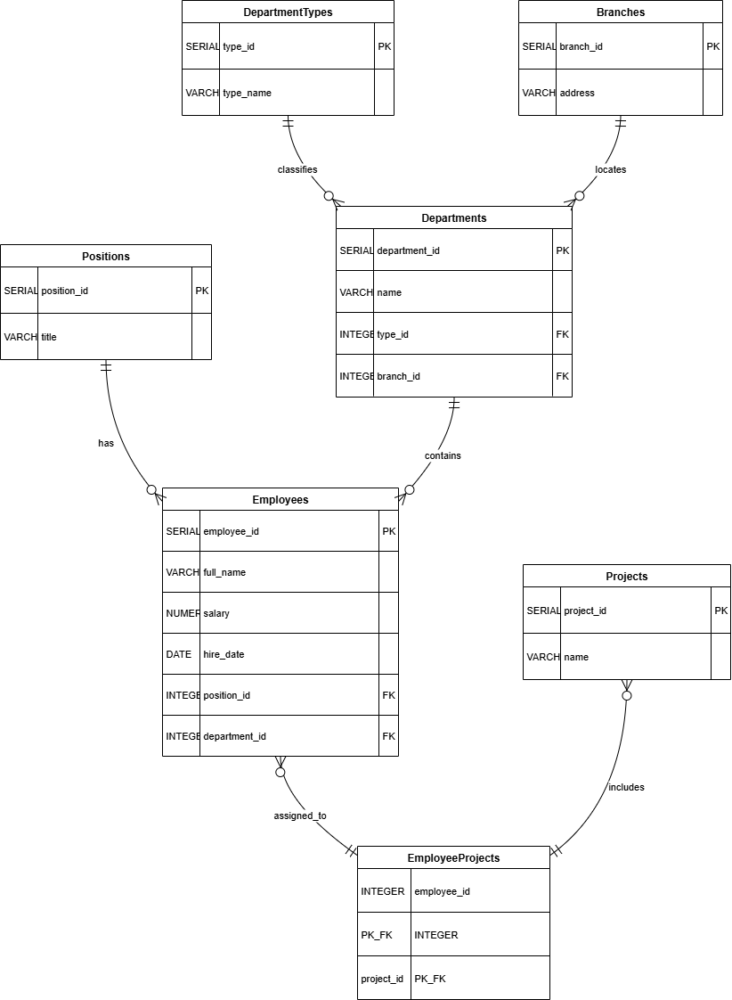
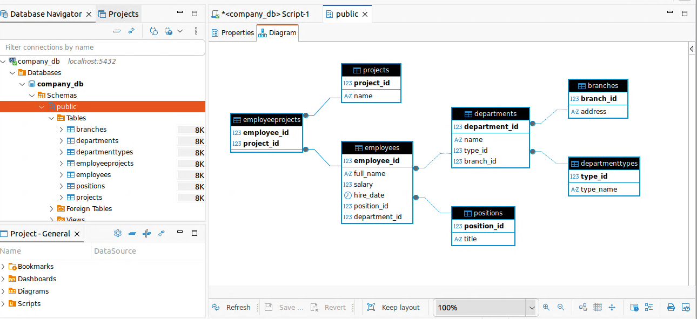

# Домашнее задание к занятию «Базы данных»

### Легенда

Заказчик передал вам [файл в формате Excel](https://github.com/netology-code/sdb-homeworks/blob/main/resources/hw-12-1.xlsx), в котором сформирован отчёт. 

На основе этого отчёта нужно выполнить следующие задания.

### Задание 1

Опишите не менее семи таблиц, из которых состоит база данных. Определите:

- какие данные хранятся в этих таблицах,
- какой тип данных у столбцов в этих таблицах, если данные хранятся в PostgreSQL.

Начертите схему полученной модели данных. Можете использовать онлайн-редактор: https://app.diagrams.net/

Этапы реализации:
1.	Внимательно изучите предоставленный вам файл с данными и подумайте, как можно сгруппировать данные по смыслу.
2.	Разбейте исходный файл на несколько таблиц и определите список столбцов в каждой из них. 
3.	Для каждого столбца подберите подходящий тип данных из PostgreSQL. 
4.	Для каждой таблицы определите первичный ключ (PRIMARY KEY).
5.	Определите типы связей между таблицами. 
6.	Начертите схему модели данных.
На схеме должны быть чётко отображены:
   - все таблицы с их названиями,
   - все столбцы  с указанием типов данных,
   - первичные ключи (они должны быть явно выделены),
   - линии, показывающие связи между таблицами.

**Результатом выполнения задания** должен стать скриншот получившейся схемы базы данных.

---



## Дополнительные задания (со звёздочкой*)
Эти задания дополнительные, то есть не обязательные к выполнению. Вы можете их выполнить, если хотите глубже и шире разобраться в материале.


### Задание 2*

1. Разверните СУБД Postgres на своей хостовой машине, на виртуальной машине или в контейнере docker.
2. Опишите схему, полученную в предыдущем задании, с помощью скрипта SQL.
3. Создайте в вашей полученной СУБД новую базу данных и выполните полученный ранее скрипт для создания вашей модели данных.

В качестве решения приложите SQL скрипт и скриншот диаграммы.

Для написания и редактирования sql удобно использовать  специальный инструмент dbeaver.

---

```sql
-- Таблица: Positions (Должности)
CREATE TABLE Positions (
    position_id SERIAL PRIMARY KEY,
    title VARCHAR(100) NOT NULL
);

-- Таблица: DepartmentTypes (Типы подразделений)
CREATE TABLE DepartmentTypes (
    type_id SERIAL PRIMARY KEY,
    type_name VARCHAR(50) NOT NULL
);

-- Таблица: Branches (Филиалы)
CREATE TABLE Branches (
    branch_id SERIAL PRIMARY KEY,
    address VARCHAR(255) NOT NULL
);

-- Таблица: Projects (Проекты)
CREATE TABLE Projects (
    project_id SERIAL PRIMARY KEY,
    name VARCHAR(255) NOT NULL
);

-- Таблица: Departments (Подразделения)
CREATE TABLE Departments (
    department_id SERIAL PRIMARY KEY,
    name VARCHAR(255) NOT NULL,
    type_id INTEGER NOT NULL,
    branch_id INTEGER NOT NULL,
    CONSTRAINT fk_type FOREIGN KEY (type_id) REFERENCES DepartmentTypes(type_id) ON DELETE RESTRICT,
    CONSTRAINT fk_branch FOREIGN KEY (branch_id) REFERENCES Branches(branch_id) ON DELETE RESTRICT
);

-- Таблица: Employees (Сотрудники)
CREATE TABLE Employees (
    employee_id SERIAL PRIMARY KEY,
    full_name VARCHAR(255) NOT NULL,
    salary NUMERIC(10,2) NOT NULL,
    hire_date DATE NOT NULL,
    position_id INTEGER NOT NULL,
    department_id INTEGER NOT NULL,
    CONSTRAINT fk_position FOREIGN KEY (position_id) REFERENCES Positions(position_id) ON DELETE RESTRICT,
    CONSTRAINT fk_department FOREIGN KEY (department_id) REFERENCES Departments(department_id) ON DELETE RESTRICT
);

-- Таблица: EmployeeProjects (Связующая таблица)
CREATE TABLE EmployeeProjects (
    employee_id INTEGER NOT NULL,
    project_id INTEGER NOT NULL,
    CONSTRAINT pk_employeeprojects PRIMARY KEY (employee_id, project_id),
    CONSTRAINT fk_employee FOREIGN KEY (employee_id) REFERENCES Employees(employee_id) ON DELETE CASCADE,
    CONSTRAINT fk_project FOREIGN KEY (project_id) REFERENCES Projects(project_id) ON DELETE CASCADE
);

-- Сообщение для проверки успешного выполнения
SELECT 'Схема базы данных успешно создана!' AS status;
```
